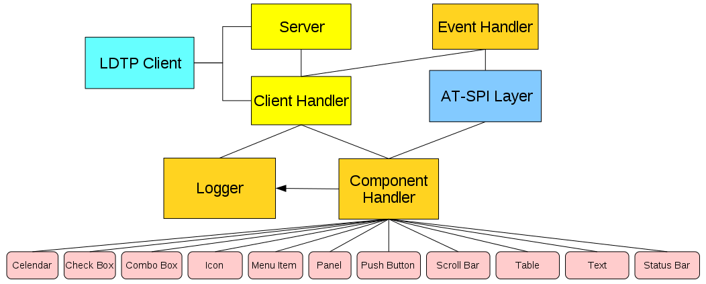

.. header::
 *Linux Desktop Testing Project – LDTP*

.. footer::
 *Linux Desktop Testing Project – LDTP http://ldtp.freedesktop.org - page ###Page###*

======================================
Linux Desktop Testing Project Tutorial
======================================

:Date: 2014-03-29
:Version: 1.1
:Authors: Nagappan Alagappan <nagappan@gmail.com>, Harsha <nharsha@gmail.com>,
Premkumar J <prem.jothimani@gmail.com>, Guofu Xu <lavixu@gmail.com>, Surendran
M <suren.silverprince@gmail.com>, Vamsi B <vamsi1985@gmail.com>, Christopher
Bayliss <christopher.j.bayliss@gmail.com>
:Document: Linux Desktop Testing Project Tutorial

Info
====

Copyright 2004 - 2007 Novell, Inc.

Copyright 2008 - 12 Nagappan Alagappan

Copyright 2014 Christopher Bayliss

Permission is granted to copy, distribute and/or modify this document under the
terms of the GNU Lesser General Public License, Version 2 or any later version
published by the Free Software Foundation; with no Invariant Sections, no
Front-Cover Texts, and no Back-Cover Texts.  A copy of the license is included
in the section entitled "GNU Lesser General Public License".

You should have received a copy of the GNU GNU Lesser General Public License
along with this documentation; if not, write to the Free Software Foundation,
Inc., 59 Temple Place - Suite 330, Boston, MA 02111-1307, USA. 

.. contents:: Table of Contents

About LDTP
==========

The Linux Desktop Testing Project (LDTP) is aimed at producing a high quality
automated testing framework and cutting-edge tools that can be used to test
GNU/Linux Desktop to improve it. It uses the Accessibility libraries to poke
through the application's user interface. This idea has been extended to
Microsoft Windows as Cobra and Mac OS X as ATOMac. With this we can proudly
say; we have implemented a cross platform GUI testing tool. LDTP is now known
to work on Windows, Mac, Linux, Palm Source, Solaris, NetBSD and FreeBSD.

The LDTP core framework uses Appmap (application map) and written test-cases to
test an application and gives the status of each test-case as the output. LDTP
can test any .NET/GNOME/KDE (QT >= 4.8) application which is accessibility
enabled, Mozilla, Open Office/Libre Office, and any Java application (should
have a UI based on Swing).

We encourage you to join the project and help us to create a robust, reliable
and stable test framework for Windows/Unix Desktops. Thanks to the Microsoft,
Apple, GNOME and Sun Microsystems Accessibility team for their great work and
their continuous support!

Audience
========

It is assumed that the user of this document has little knowledge about UI
controls in any GUI application and minimal Windows/Mac OS X/Linux or
Unix (Solaris/BSD) knowledge.

About testing
=============

Testing is a process to identify defects in a (software) system, for more
information see http://en.wikipedia.org/wiki/Software_testing. Testing an
application multiple times with the same steps can get rather slow and
annoying; therefore automating the process can do a better job.

What is the complexity of GUI testing?

* Identification of object in a window (push button, menu item).
* Should be context sensitive (Window specific operation).
* Handling of unexpected pop-up windows.
* Keeping the test script in sync with UI changes.
* Failures need to be verified on each operation.
* Rendering of images/text in the display area.

What type of testing can be done using LDTP?

LDTP can be used to test the functionality of any accessibility enabled
application.

Advantage of accessibility based testing.

* Accessibility libraries provide applications property, state, its child items etc.
* No need to work in toolkit (GTK, AWT, QT) level

Disadvantage of accessibility based testing.

* Application which are not accessibility enabled can't be tested.

What applications can be tested?

As of now, LDTP can test any .NET, GNOME applications which are accessibility
enabled, Mozilla, OpenOffice.org/Libreoffice, any Java application (should have
swing UI) and KDE applications based on QT 4.8.

Supported platforms
-------------------

* openSuSE
* OpenSolaris
* Debian
* Madriva
* Ubuntu
* Fedora
* SLES
* SLED
* RHEL
* CentOS
* FreeBSD
* NetBSD
* Windows (XP SP3/Vista SP2/7 SP1/8)
* Mac OS X (>=10.6)
* Embedded Platform (Palm Source/Access Company)

Supported languages
-------------------

* Python
* Clojure
* Java
* Ruby
* C#
* VB.NET
* Power Shell
* Perl

LDTP Features
=============

* LDTP concepts are derived from Software Automation Framework Support.
* LDTP supports verification of actions performed (guiexist(), verifystate, etc).
* Writing test scripts is very easy, and the script writer doesn't need to know
  about the object hierarchy.
* CPU/Memory performance monitoring of application-under-test can be measured.

LDTP on web
===========

Website:
    http://ldtp.freedesktop.org

Source/Binaries:
    http://ldtp.freedesktop.org/wiki/Download

API reference:
    http://ldtp.freedesktop.org/wiki/Docs

HOWTO:
    http://ldtp.freedesktop.org/wiki/HOWTO

FAQ:
    http://ldtp.freedesktop.org/wiki/FAQ

Dev mailing list:
    http://lists.freedesktop.org/mailman/listinfo/ldtp-dev

IRC:
    #ldtp on irc.freenode.net

Install LDTP
============

Disk space requirements
-----------------------

Less than 450 KB (Linux), 5 MB (Windows) and 450 KB (Mac OS X)

Software requirements
---------------------

Install the following dependency packages (Linux)

* python-atspi or relevant name in your distribution.
* twisted-web or relevant name in your distribution.
* python-gnome or relevant name in your distribution.

Install the following dependency packages (Mac OS X)

* Xcode, if you plan to compile the software, else use egg from pypi.

Optional packages (Linux)

* Import tool of ImageMagick - To capture a screenshot.
* Python Imaging Library - Compare images, black out a region in an image.
* pystatgrab - CPU / Memory utilization monitoring library.

Setup LDTP from scurce
----------------------

Download the source (Linux):

   git clone https://github.com/ldtp/ldtp2;
   cd ldtp2

Download the source (Windows):

   git clone https://github.com/ldtp/cobra.git

Download the source (Mac OS X):

   git clone https://github.com/ldtp/pyatom.git;
   cd pyatom

Build and install LDTP on a Linux/Mac OS X environment:
   python setup.py build
   sudo python setup.py install

Setup LDTP from binary
----------------------

Download latest Mac OS X, Windows, RPM, Deb, Gentoo, Solaris package from
http://ldtp.freedesktop.org/wiki/Download

Architecture
============

LDTP Overall Architecture
-------------------------

Test scripts uses LDTP API interface, which in-turn communicate to LDTP engine
either by UNIX socket or by TCP socket. LDTP engine talks to Application under
test (AUT) using AT-SPI library.

LDTP Internals
--------------

LDTP Clients can talk to LDTP engine with XML RPC protocol.

Most of LDTP ideas are implemented from http://safsdev.sf.net. Most commands
at-least 2 arguments. First argument will be context (window in which we want to
operate) and the second argument will be component (object in which we want to
operate, based on the current context).

.. code-block:: python

    click('*-gedit', 'btnNew') # Click operation will be performed on a window
    #which is having *-gedit(regexp) and in that window object name 'New', which is
    #of type 'push button'.

Server
------

When a test script is started, the LDTP client will establish a connection with
the LDTP engine using AF_UNIX/AF_INET.

Client Handler
--------------

Whenever a command is executed from the script, the client frames the XML data
and send it to the server. LDTP engine parses the command request from the
client and invoke the respective Component Handler.

Component Handler
-----------------

Each individual component handlers uses the AT-SPI libraries to communicate to
the respective application. Based on the execution status, success or failure
will be notified as a response (in XML format) to the client. In few cases the
requested data from the respective component will be returned to the client,
based on the request (example: gettextvalue).

Event Handler
-------------

For unexpected windows (example: connection reset by peer /connection timed out
dialogs) can be handled by registering a callback function and the respective
callback function will be called, whenever the registered window with the title
appears and even this window could be based on regular expression.

LDTP conventions
================

Appmap
------

'Appmap' [Application Map in short] is a text based representation of the GUI
which is under testing. Each and every UI control viz., Button, Text Box etc.,
are represented using predefined conventions (which are listed in the table
below) along with their parent UI object information. At runtime, a particular
UI control is accessed by using the Appmap generated for the GUI under testing.

For more details about Appmap refer to:

http://safsdev.sourceforge.net/DataDrivenTestAutomationFrameworks.htm#TheApplicationMap

Appmap convention
-----------------

+---------------------------------------+------------------------------------------+
| *Class keywords*                      | *Convention used in appmap*              |
+---------------------------------------+------------------------------------------+
| ACCEL_LABEL                           |                                          |
+---------------------------------------+------------------------------------------+
| ALERT                                 | dlg                                      |
+---------------------------------------+------------------------------------------+
| ANIMATION                             |                                          |
+---------------------------------------+------------------------------------------+
| ARROW                                 |                                          |
+---------------------------------------+------------------------------------------+
| CALENDAR                              | cal                                      |
+---------------------------------------+------------------------------------------+
| CANVAS                                | cnvs                                     |
+---------------------------------------+------------------------------------------+
| CHECK_BOX                             | chk                                      |
+---------------------------------------+------------------------------------------+
| CHECK_MENU_ITEM                       | mnu                                      |
+---------------------------------------+------------------------------------------+
| COLOR_CHOOSER                         |                                          |
+---------------------------------------+------------------------------------------+
| COLUMN_HEADER                         |                                          |
+---------------------------------------+------------------------------------------+
| COMBO_BOX                             | cbo                                      |
+---------------------------------------+------------------------------------------+
| DATE_EDITOR                           |                                          |
+---------------------------------------+------------------------------------------+
| DESKTOP_ICON                          |                                          |
+---------------------------------------+------------------------------------------+
| DESKTOP_FRAME                         | frm                                      |
+---------------------------------------+------------------------------------------+
| DIAL                                  | dial                                     |
+---------------------------------------+------------------------------------------+
| DIALOG                                | dlg                                      |
+---------------------------------------+------------------------------------------+
| DIRECTORY_PANE                        |                                          |
+---------------------------------------+------------------------------------------+
| DRAWING_AREA                          | dwg                                      |
+---------------------------------------+------------------------------------------+
| FILE_CHOOSER                          | dlg                                      |
+---------------------------------------+------------------------------------------+
| FILLER                                | flr                                      |
+---------------------------------------+------------------------------------------+
| FONT_CHOOSER                          | dlg                                      |
+---------------------------------------+------------------------------------------+
| FRAME                                 | frm                                      |
+---------------------------------------+------------------------------------------+
| GLASS_PANE                            |                                          |
+---------------------------------------+------------------------------------------+
| HTML_CONTAINER                        | html                                     |
+---------------------------------------+------------------------------------------+
| ICON                                  | ico                                      |
+---------------------------------------+------------------------------------------+
| IMAGE                                 | img                                      |
+---------------------------------------+------------------------------------------+
| INTERNAL_FRAME                        |                                          |
+---------------------------------------+------------------------------------------+
| LABEL                                 | lbl                                      |
+---------------------------------------+------------------------------------------+
| LAYERED_PANE                          | pane                                     |
+---------------------------------------+------------------------------------------+
| LIST                                  | lst                                      |
+---------------------------------------+------------------------------------------+
| LIST_ITEM                             | lsti                                     |
+---------------------------------------+------------------------------------------+
| MENU                                  | mnu                                      |
+---------------------------------------+------------------------------------------+
| MENU_BAR                              | mbar                                     |
+---------------------------------------+------------------------------------------+
| MENU_ITEM                             | mnu                                      |
+---------------------------------------+------------------------------------------+
| OPTION_PANE                           | opan                                     |
+---------------------------------------+------------------------------------------+
| PAGE_TAB                              | ptab                                     |
+---------------------------------------+------------------------------------------+
| PAGE_TAB_LIST                         | ptl                                      |
+---------------------------------------+------------------------------------------+
| PANEL                                 | pnl                                      |
+---------------------------------------+------------------------------------------+
| PASSWORD_TEXT                         | txt                                      |
+---------------------------------------+------------------------------------------+
| POPUP_MENU                            | pop                                      |
+---------------------------------------+------------------------------------------+
| PROGRESS_BAR                          | pbar                                     |
+---------------------------------------+------------------------------------------+
| PUSH_BUTTON                           | btn                                      |
+---------------------------------------+------------------------------------------+
| RADIO_BUTTON                          | rbtn                                     |
+---------------------------------------+------------------------------------------+
| RADIO_MENU_ITEM                       | mnu                                      |
+---------------------------------------+------------------------------------------+
| ROOT_PANE                             | rpan                                     |
+---------------------------------------+------------------------------------------+
| ROW_HEADER                            | rhdr                                     |
+---------------------------------------+------------------------------------------+
| SCROLL_BAR                            | scbr                                     |
+---------------------------------------+------------------------------------------+
| SCROLL_PANE                           | scpn                                     |
+---------------------------------------+------------------------------------------+
| SEPARATOR                             | sep                                      |
+---------------------------------------+------------------------------------------+
| SLIDER                                | sldr                                     |
+---------------------------------------+------------------------------------------+
| SPIN_BUTTON                           | sbtn                                     |
+---------------------------------------+------------------------------------------+
| SPLIT_PANE                            | splt                                     |
+---------------------------------------+------------------------------------------+
| STATUS_BAR                            | stat                                     |
+---------------------------------------+------------------------------------------+
| TABLE                                 | tbl                                      |
+---------------------------------------+------------------------------------------+
| TABLE_CELL                            | tbl                                      |
+---------------------------------------+------------------------------------------+
| TABLE_COLUMN_HEADER                   | tch                                      |
+---------------------------------------+------------------------------------------+
| TABLE_ROW_HEADER                      | trh                                      |
+---------------------------------------+------------------------------------------+
| TEAROFF_MENU_ITEM                     | tmi                                      |
+---------------------------------------+------------------------------------------+
| TERMINAL                              | term                                     |
+---------------------------------------+------------------------------------------+
| TEXT                                  | txt                                      |
+---------------------------------------+------------------------------------------+
| TOGGLE_BUTTON                         | tbtn                                     |
+---------------------------------------+------------------------------------------+
| TOOL_BAR                              | tbar                                     |
+---------------------------------------+------------------------------------------+
| TOOL_TIP                              | ttip                                     |
+---------------------------------------+------------------------------------------+
| TREE                                  | tree                                     |
+---------------------------------------+------------------------------------------+
| TREE_TABLE                            | ttbl                                     |
+---------------------------------------+------------------------------------------+
| UNKNOWN                               | unk                                      |
+---------------------------------------+------------------------------------------+
| VIEWPORT                              | view                                     |
+---------------------------------------+------------------------------------------+
| WINDOW                                | dlg                                      |
+---------------------------------------+------------------------------------------+
| EXTENDED                              |                                          |
+---------------------------------------+------------------------------------------+
| HEADER                                | hdr                                      |
+---------------------------------------+------------------------------------------+
| FOOTER                                | foot                                     |
+---------------------------------------+------------------------------------------+
| PARAGRAPH                             | para                                     |
+---------------------------------------+------------------------------------------+
| RULER                                 | rul                                      |
+---------------------------------------+------------------------------------------+
| APPLICATION                           | app                                      |
+---------------------------------------+------------------------------------------+
| AUTOCOMPLETE                          | txt                                      |
+---------------------------------------+------------------------------------------+
| CALENDARVIEW                          | cal                                      |
+---------------------------------------+------------------------------------------+
| CALENDAREVENT                         | cal                                      |
+---------------------------------------+------------------------------------------+
| EDITBAR                               | txt                                      |
+---------------------------------------+------------------------------------------+
| ENTRY                                 | txt                                      |
+---------------------------------------+------------------------------------------+

Example Applications
====================

Examples will use gedit.  You can download it from
https://wiki.gnome.org/Apps/Gedit#Download.

If you are using a linux distro, the install gedit with you package manager.

How to Access UI Objects from LDTP scripts
==========================================

There are two main entities to act on an object: window name and object name.

Window name
-----------

To operate on a window, we need to know the window name (nothing but the window title).

Different window types
~~~~~~~~~~~~~~~~~~~~~~

1. Frame (frm)
2. Dialog (dlg)
3. Alert (dlg)
4. Font Chooser (dlg)
5. File Chooser (dlg)
6. Window (This type in general does not have any associated title,
   so we need to represent them using index - dlg)

Glob pattern support
~~~~~~~~~~~~~~~~~~~~

Window name can be clubbed with glob patterns (* or ?)

EXAMPLE:
    1. *-gedit means the title has -gedit in it, BUT can have anything before
       it or after it.
    2. ????-gedit means the title has -gedit in it, AND has four cractors
       before it.

    .. NOTE:: You can use * or ? anywhere for the title name.

Different ways of representing window name
~~~~~~~~~~~~~~~~~~~~~~~~~~~~~~~~~~~~~~~~~~
1. Window type and window title (Ex: 'frmnew1-')
2. Window title (Ex: 'Unsaved Document 1 - gedit*')
3. Window type, glob expression and partial window title (Ex: 'frm*-gedit')
4. Glob pattern and partial window title (Ex: '*-gedit')
5. Window type, partial window title and glob pattern (Ex: 'frmnew1*')
6. Window type, window title and index (If two windows of same title exist at
   same time. Ex: First window name 'dlgAppoinment', Second window name
   'dlgAppoinment1')
7. Window type and index (only if window does not have any accessible title,
   Ex: 'dlg0')

Window name formats
~~~~~~~~~~~~~~~~~~~

If window label contains space or new line characters, they will be stripped.

Example:
    1. 'saved-doc - gedit*', will be represented as 'saved-doc-gedit*'
    2. 'Unsaved Document 1 - gedit*', will be represented as
       'UnsavedDocument1-gedit*'

Object name
-----------

Object (the type of control in which we want to operate) can be identified
either with a label or by an associated label.

Label
~~~~~

In general menu/menu item/push button/toggle button type controls can be
accessed through its label.

Example:

.. code-block:: python

  mnuFile # (gedit menu)
  mnuNew # (gedit menu item)
  btnNew # (gedit tool bar, push button)
  tbtnLocation # (gedit Open File dialog, toggle bar control)

Label by/for (associated label)
~~~~~~~~~~~~~~~~~~~~~~~~~~~~~~~

In general text/tables/check box/radio button/spin button/combo box controls
can be accessed using the associated label only.

Example:

.. code-block:: python

  txtLocation # (gedit Open File dialog, text control)
  tblFiles # (gedit Open File dialog, table control)
  cboSearchfor # (gedit Find dialog, combo box control)
  chkMatchcase # (gedit Find dialog, check box control)
  sbtnRightmarginatcolumn # (gedit Preferences dialog, spin button control)

Object name with out label/associated label accessing via index
~~~~~~~~~~~~~~~~~~~~~~~~~~~~~~~~~~~~~~~~~~~~~~~~~~~~~~~~~~~~~~~

If a control does not have any label or associated label, then it can be
accessed using index.

Example:

.. code-block:: python

  txt0 # (gedit text rendering region)
  ptl0 # (gedit Preferences dialog, page tab list control)
  ptl0 # (In gedit when more than one files are opened,
       # a page tab list control will be available)

Object name with index
~~~~~~~~~~~~~~~~~~~~~~

In some cases, a control type can be present in multiple places in the same
window and chances that it may have same label too in that case, the first
control can be accessed just with the default notation, but the second control
and further can be accessed with the format control type, label or associated
label and index starting from 1.

Example:

.. code-block:: python

  btnAdd #First push button control with label Add
  btnAdd1 #Second push button control with label Add
  btnAdd2 #Third push button control with label Add

Object name with window id (Windows only)
~~~~~~~~~~~~~~~~~~~~~~~~~~~~~~~~~~~~~~~~~

Object can be identified with window id, which is unique across all the
application that are currently running, even on i18n/l10n environment. Object
name when passed to the API, it should start with # and then the unique number,
for the widget.

Example::

  #1234 #With Visual UI Verify this is represented as Automation Id

Object identification with object type and index
~~~~~~~~~~~~~~~~~~~~~~~~~~~~~~~~~~~~~~~~~~~~~~~~

On a window, identify the control with index of widget type. Object name format
passed should be, LDTP convention object type and object index, respective to
the given object type.

Example::

  btn#0 – First button on the current window
  txt#1 – Second text widget on the current window

Object name formats
~~~~~~~~~~~~~~~~~~~

If object label or associated label contains space, dot, colon, under score or
new line characters, they will be stripped.

Example::

  'Search for:' will be represented as 'Searchfor'
  'File name 'a_txt' already exist.
  Replace' will be represented as 'Filename'atxt'alreadyexistReplace'.

Accessibility library
=====================

LDTP uses accessibility libraries (at-spi) available in GNOME environment. Using
accessibility we can get the information about the application and its current
state (property). We can be able to poke through each layer in any application,
if and only if, the application has accessibility enabled.

Enabling accessibility
======================

**GNOME 2.x:** Go to System > Preferences > Assistive Technologies and enable
Assistive Technology.

**GNOME 3.x:** Run the following command from command line to enable accessibility

.. code-block:: bash

    gsettings set org.gnome.desktop.interface toolkit-accessibility true

**Microsoft Windows:** No need to change any settings, as accessibility is
enabled by default.

**Mac OSX:** System wide accessibility must be enabled. Check the check box:
System Preferences > Universal Access > Enable access for assistive devices.
Failure to enable this will result in ErrorAPIDisabled exceptions during some
module usage.

Drawing 2: Screenshot of Assisstive technology preferences dialog

Importing LDTP modules
======================

We prefer to import everything, if we do we can just directly use all the ldtp
functions just by calling their name. If we import the module as 'import ldtp',
then we need to call the corresponding function as ldtp.<function_name>

To import ldtp in python, do:

.. code-block:: python

    >>> from ldtp import *
    >>> from ldtputils import *
    >>> from ooldtp import *

Example 1:

.. code-block:: python

    >>> from ldtp import *
    >>> selectmenuitem('*-gedit', 'mnuFile;mnuNew')

Example 2:

.. code-block:: python

    #!/usr/bin/python

    # The standard import stuff.
    from ldtp import *
    from ooldtp import context as locate
    from time import sleep

    # Here we open the app.
    launchapp('gedit')

    # Now we find it and make sure it is open.
    gedit_win = locate('*gedit')
    gedit_win.waittillguiexist()

    # Now we type into gedit.
    text_field = gedit_win.getchild('txt1')
    text_field.enterstring("G'Day mate!")

    # Save a picture to prove we did it.
    imagecapture('*gedit', '/tmp/foo.png')

    # Quit gedit.
    quit = gedit_win.getchild('mnuQuit')
    quit.selectmenuitem()

    # Close without saving.
    dont_save = locate('Question')
    dont_save.waittillguiexist()

    button = dont_save.getchild('btnClosewithoutSaving')
    button.click()

    # Wait until gedit is gone.
    gedit_win.waittillguinotexist()()

Call a function to perform an operation
---------------------------------------

LDTP generally operates on the given object in a particular window.

To select a menu item, you need to call the selectmenuitem function. For
example, to select open menu item in gedit application, call the below
function:

.. code-block:: python

    >>> selectmenuitem('frmUnsavedDocument1-gedit', 'mnuFile;mnuOpen')

When you call the above a new dialog box will be poped up, you can verify
whether the window is opened or not either by guiexist() or by
waittillguiexist().

.. NOTE:: The guiexist() function immediately returns either 1 (window exists) or
          0 (window does not exist), waittillguiexist() waits for the window to
          appear.  Wait time out is by default 30 seconds. This default time
          out can be either increased on decreased using GUI_TIMEOUT.

If you want to operate on a push button in a window, you need to call click(),
e.g.: To press 'Cancel' button in a GTK Open File Selector dialog:

.. code-block:: python

    >>> click('dlgOpenFile', 'btnCancel')

When you do the above operation the GTK File selector dialog disappears. To
verify whether the window actually quits or not use:

.. code-block:: python

    >>> waittillguinotexist()()

If you modify any opened file in gedit, the window title will be modified. To
continue operating on the window you need to change your context of operation.
Reason: As you are aware that LDTP works based on individual window, the
context of window will be changed, when the title changes. To over come this
use:

.. code-block:: python

    >>> setcontext()

and when you don't require them use:

.. code-block:: python

    >>> releasecontext()

Edit your current opened file using:

.. code-block:: python

    >>> settextvalue('frmUnsavedDocument1-gedit', 'txt0', 'Testing editing')

This will change the window title. Note, before doing the above operation,
title will be 'Unsaved Document 1 - gedit' and after editing the title will
look like '*Unsaved Document 1 - gedit'. To further
operate on the same window, use:

.. code-block:: python

    >>> setcontext('Unsaved Document 1 - gedit', '*Unsaved Document 1 - gedit')

So that you can continue using the same window name, for example:

.. code-block:: python

    >>> selectmenuitem('frmUnsavedDocument1-gedit', 'mnuFile;mnuSaveAs')

The above function will invoke the GTK save dialog box. If any of the action
releated functions (example: selectmenuitem, click, settextvalue) fail, an
exception is raised. It has to be handled by the program to either continue
operating on execution or just halt.

LDTP API
--------

Refer LDTP API page for list of implemented LDTP API's 

Using/Hacking LDTP
==================

Identifying controls
--------------------

To operate on a window, first thing we need to know is the window title.

In the following picture you could notice red colored eclipse mark is the
window title.

.. code-block:: python

  >>> from ldtp import *
  >>> guiexist('*-gedit')
  1
  >>> guiexist('frmUnsavedDocument1-gedit')
  1
  >>> guiexist('frmUnsavedDocument1-*')
  1
  >>> guiexist('frm*-gedit')
  1
  >>> guiexist('Unsaved Document 1 - gedit')
  1

Push button
-----------

To operate on an object inside gedit window, we need to know the object
information.

To click on open push button in gedit tool bar control, we need to use click
API with window name as first argument and object name as second argument. The
above command does the click operation. Information to be gathered is Window
name (Unsaved Document 1 – gedit) and push button control (Open).

.. code-block:: python

  >>> from ldtp import *
  >>> click('*-gedit', 'btnOpen')
  1

Menu item
---------

To select a menu item under a menu in a window we need to use selectmenuitem
API.

Informations to be gathered: Window name (Unsaved Document 1 – gedit), menu
control (File), menu item control (New).

Incase of menu, we handle them in hierarchy. So, to access 'New' menu item, we
need 'File' menu control too.

.. code-block:: python

  >>> from ldtp import *
  >>> selectmenuitem('*-gedit', 'mnuFile;mnuNew')
  1

Toggle button
-------------

To operate on a toggle button with a click action, information required are
window name (Open Files...) toggle button control (Type a file name).

.. code-block:: python

  >>> from ldtp import *
  >>> click('dlgOpenFiles...', 'tbtnTypeafilename')
  1

Text control
------------

To set a text value in a text box, information like window name (Open Files...),
text controls associated label (Location:) and the actual text to be
placed (Class1.cs).

.. code-block:: python

  >>> from ldtp import *
  >>> settextvalue('dlgOpenFiles...', 'txtLocation', 'Class1.cs')
  1

Table control
-------------

To select a row from the table of GTK open file selector, we need to collect
information like, Window name (Open Files...), table name (Files – circled with
blue color), row to be selected (Class1.cs).

.. code-block:: python

  >>> from ldtp import *
  >>> selectrow('dlgOpenFiles...', 'tblFiles', 'Class1.cs')
  1

Push button
-----------

After selecting the file name, to open the file contents, we need to click on
Open push button control. For doing this operation we need to gather
informations like Window name (Open Files...), push button label name (Open).

.. code-block:: python

  >>> from ldtp import *
  >>> click('dlgOpenFiles...', 'btnOpen')
  1

Check box
---------

To click on a check box control, we need to collect informations like window
name (gedit Preferences), check box associated label name (Display line numbers).

.. code-block:: python

  >>> from ldtp import *
  >>> click('dlggeditPreferences', 'chkDisplaylinenumbers')
  1

.. code-block:: python

  >>> from ldtp import *
  >>> check('dlggeditPreferences', 'chkEnabletextwrapping')
  1

.. code-block:: python

  >>> from ldtp import *
  >>> uncheck('dlggeditPreferences', 'chkDisplaylinenumbers')
  1

Spin button
-----------

To operate on a spin button, we need to collect information like Window
name (gedit Preferences), spin button control name (Right margin at column).

.. code-block:: python

  >>> from ldtp import *
  >>> getvalue('dlggeditPreferences', 'sbtnRightmarginatcolumn')
  80.0
  >>> setvalue('dlggeditPreferences', 'sbtnRightmarginatcolumn', '81')
  1
  >>> setvalue('dlggeditPreferences', 'sbtnRightmarginatcolumn', '80')
  1

Page tab
--------

To operate on a page tab list, we need to collect information like window
name (gedit Preferences), page tab list name (ptl0 in this case, as there are no
label or associated label with this page tab list control), page tab name or
index starting from 0.

.. code-block:: python

  >>> from ldtp import *
  >>> gettabcount('dlggeditPreferences', 'ptl0')
  5
  >>> selecttabindex('dlggeditPreferences', 'ptl0', 2)
  1
  >>> selecttab('dlggeditPreferences', 'ptl0', 'Editor')
  1

Check menu item
---------------

To operate on check menu item, we need to gather information like window
name (Unsaved Document 1 – gedit), menu name (View), check menu item name
(Side Pane).

.. code-block:: python

  >>> from ldtp import *
  >>> selectmenuitem('*-gedit', 'mnuView;mnuSidePane')
  1
  >>> menuuncheck('*-gedit', 'mnuView;mnuSidePane')
  1

.. code-block:: python

  >>> from ldtp import *
  >>> menucheck('*-gedit', 'mnuView;mnuStatusbar')
  1

Radio menu item
---------------

To operate on a radio menu item control, we need to gather informations like
window name (Unsaved Document 1 – gedit), menu name (Documents), menu item
name (Class1.cs – assuming that Class1.cs is currently opened).

.. code-block:: python

  >>> from ldtp import *
  >>> selectmenuitem('*-gedit', 'mnuDocuments;mnuClass1.cs')
  1
  >>> menucheck('*-gedit', 'mnuDocuments;mnuClass1.cs')
  1

Combo box – Menu item
---------------------

To select a menu item under a combo box, we need to gather informations like
window name (Open Files...), combo box name (Character Coding), menu item
name (Current Locale).

.. code-block:: python

  >>> from ldtp import *
  >>> comboselect('dlgOpenFiles...', 'cboCharacterCoding', 'Current Locale(UTF-8)')
  1

Combo box – List item
---------------------

To operate on list item under a combo box control, we need to gather
informations like window name (Find), Combo box control name (Search for), list
item existing content or list item index or new item
name (OdbcMetaDataCollectionName.cs)

.. code-block:: python

  >>> from ldtp import *
  >>> settextvalue('dlgFind', 'cboSearchfor', 'OdbcMetaDataCollectionNames.cs'')
  1

.. code-block:: python

  >>> from ldtp import *
  >>> comboselect('dlgFind', 'cboSearchfor', 'OdbcMetaDataCollectionNames.cs')
  1

Launch application
------------------

Application to be tested can be launched using LDTP API launchapp.

.. code-block:: python

  >>> from ldtp import *
  >>> launchapp('gedit')
  1

GUI exist
---------

To check if a GUI (window) exists, you can use this guiexist() API. Also it has
different flavors like waittillguiexist(), waittillguinotexist().

The guiexist() function checks whether the given window exists or not. If it exists
returns 1, else returns 0.

waittillguiexist() function will wait for the given window to appear. If
appeared returns 1, else returns 0. Difference between guiexist() and
waittillguiexist() is, guiexist() returns immediately, but waittillguiexist()
will wait for a max of 30 seconds for a window to appear. Note: On doing some
operation, if the expected result is, a window will be pop-ed up, then it is
recommended to use waittillguiexist(), instead of wait or sleep. Reason: wait
or sleep will wait till the time period, but waittillguiexist(), will return
immediately once the window appears.

waittillguinotexist() function will wait for the given window to close. If
closed returns 1, else returns 0. waittillguinotexist() will wait for a max of
30 seconds for a window to close. Note: On doing some operation, if the
expected result is, an existing window will be closed, then it is recommended
to use waittillguinotexist(), instead of wait or sleep. Reason: wait or sleep
will wait till the time period, but waittillguinotexist(), will return
immediately once the window closed.

Timeout
-------

GUI timeout
~~~~~~~~~~~

GUI timeout, is the default timeout settings used, by waittillguiexist() and
waittillguinotexist() functions. This function will wait for the specified
number of seconds, for the window to either appear or disappear. Default
timeout period is 30 seconds.

This default timeout period that can be modified:

* By setting the environment variable GUI_TIMEOUT to whatever seconds.
* By passing a value to guiTimeOut argument of  waittillguiexist() or
  waittillguinotexist() functions.
* By calling guitimeout function.
* When invoking LDTP engine, use -g option.

*Example 1*

.. code-block:: bash

  export GUI_TIMEOUT=30

*Example 2*

.. code-block:: python

  waittillguiexist('*-gedit', guiTimeOut=30)
  waittillguinotexist('dlgOpenFiles...', guiTimeOut=30)

*Example 3*

.. code-block:: python

  guitimeout(30)

*Example 4*

.. code-block:: bash

  ldtp -g 30

OBJ timeout
~~~~~~~~~~~

OBJ timeout, is the default timeout settings used, internally. This function
will wait for the specified number of seconds, for the object inside a window
to appear. Default timeout period is 5 seconds.

This default timeout period that can be modified:

* By setting the environment variable OBJ_TIMEOUT to whatever seconds.
* By calling objtimeout function.
* When invoking LDTP engine, use -o option.

*Example 1*

.. code-block:: bash

  export OBJ_TIMEOUT=5

*Example 2*

.. code-block:: python

  objtimeout(5)

*Example 3*

.. code-block:: bash

ldtp -o 5

Generate raw keyboard events
----------------------------

In some cases, the window we are trying to operate may not be accessibility
enabled or we may need to generate non-printable keys (ALT, CTRL, ENTER,
BACKSPACE, ESC, F1-F12, SHIFT, CAPS LOCK, TAB, PAGE UP, PAGE DOWN, HOME, END,
RIGHT / LEFT / UP / DOWN ARROW KEYS, INS, DEL). We can use generatekeyevent
function or enterstring function to simulate the key events, as if the user
typed. Note: All the non-printable characters will be enclosed with in angular
brackets.

*Example 1*

.. code-block:: python

  <ctrl>lwww.google.co.in<enter>

*Example 2*

.. code-block:: python

  <alt><f1>

*Example 3*

.. code-block:: python

  <control>s

.. code-block:: python

  >>> from ldtp import *
  >>> launchapp('gedit')
  1
  >>> waittillguiexist('*-gedit')
  1
  >>> enterstring('<alt><tab>')
  1
  >>> enterstring('*-gedit', 'txt0', '<caps>Testing enterstring API<enter>')
  1
  >>> generatekeyevent('<alt><tab>')
  1

Generate raw mouse events
-------------------------

To generate raw mouse events of different types like, b1c, b1d, b2c, b2d, b3c,
b3d, X and Y of screen co-ordinates has to be provided. Here b is button, c is
single click, d is double click.

.. code-block:: python

  >>> from ldtp import *
  >>> generatemouseevent(100, 200) # Default is b1c
  1
  >>> generatemouseevent(100, 200, 'b1d') # To generate double click
  1

Application information
-----------------------

On calling getapplist, will get all the accessibility application name that are
currently running. To get window list for which the application map's are
gathered and stored in local cache, use getwindowlist. To get all the object
list under a window, use getobjectlist API. To get a list of properties
available under an object, use getobjectinfo. To get the property of an object,
use getobjectproperty.

.. code-block:: python

  >>> from ldtp import *
  >>> getapplist()
  [u'gnome-session', u'gnome-power-manager', u'gnome-settings-daemon', u'Libbonoboui-Gtk-Module-init-info',
    u'nautilus', u'GnomeApplicationBrowser', u'/usr/lib/zen-updater/ZenUpdater.exe', u'gaim',
    u'gtk-window-decorator', u'gedit', u'xchat', u'gnome-panel', u'gnome-volume-manager', u'resapplet',
    u'nm-applet', u'soffice.bin']
  >>> getwindowlist()
  [u'frmUnsavedDocument1-gedit']
  >>> getobjectlist('*-gedit')
  ...
  >>> getobjectinfo('*-gedit', 'btnNew')
  [u'child_index', u'class', u'description', u'parent', u'label']
  >>> getobjectproperty('*-gedit', 'btnNew', 'class')
  'New'

Callback – On new window creation
---------------------------------

Register a callback event, when a window with given title is created. Glob type
pattern can be given as title name.

Advantage
---------

Unexpected window can be easily handled using this. For example, the password
dialog box of Evolution, connection reset by peer dialog, application crash
dialog, etc.

Example
-------

.. code-block:: python

    from ldtp import *
    import threading
    # Thread creation
    callbackRunning = threading.Event()
    callbackRunning.clear()
    callbackState = threading.Event()
    callbackState.clear()
    # Callback definition
    def cb():
        callbackState.set()
        waittillguiexist('dlgReplace')
        click('dlgReplace', 'btnClose')
        callbackState.clear()
        callbackRunning.set()
        print 'callbackend'
    # Callback registration
    onwindowcreate('Replace', cb)
    # General operation, which will invoke a window
    click('*gedit', 'btnReplace')
    click('*gedit', 'btnOpen')
    waittillguiexist('dlgOpenFiles...')
    click('dlgOpenFiles...', 'btnClose')
    # Wait for callback to complete, if invoked
    if callbackState.isSet():
        print 'Waiting for callback to complete'
        callbackRunning.wait()
        print 'callbackset'
    print 'test end'

Logging
-------

.. code-block:: python

  >>> from ldtp import *
  >>> log('test script', 'debug')
  1
  >>> log('test script', 'warning')
  1
  >>> log('test script', 'error')
  1
  >>> log('test script', 'cause')
  1

Example script
==============

.. code-block:: python

  from ldtp import *
  from ldtputils import *

  try:
      launchapp('gedit')
      if waittillguiexist('*-gedit') == 0:
          raise LdtpExecutionError('Gedit window does not exist')
      selectmenuitem('*-gedit', 'mnuFile;mnuOpen')
      if waittillguiexist('dlgOpenFiles') == 0:
          raise LdtpExecutionError('Open Files dialog does not exist')
      selectrow('dlgOpenFiles...', 'tblFiles', fileName [0])
      click('dlgOpenFiles...', 'btnOpen')
      if waittillguinotexist('dlgOpenFiles') == 0:
          raise LdtpExecutionError('Open Files dialog still exist')
  except LdtpExecutionError, msg:
      raise

How to execute LDTP scripts
===========================

Make sure that you have the following files in current working directory 
You need to have test scripts to be executed 

Invoking python script 

.. code-block:: bash

  $ python <script-file-name.py>

Example

.. code-block:: python

  $ python gedit.py

Suggestions from LDTP team
==========================

When a new window is expected after an operation, we suggest to use
waittillguiexist() and on some operation, if a window is expected to close we
suggest to use waittillguinotexist(). In both cases, the time-out period is 30
seconds. This value can be modified – refer LDTP API reference.

How to operate LDTP from a remote system
========================================

LDTP engine (Linux)
-------------------

Follow one of the options to start LDTP engine (ldtp binary) in the remote box

*Option 1*

.. code-block:: bash

    $ ldtp -p

*Option 2*

.. code-block:: bash

    $ ldtp -p <port number to start> # Default port number is 4118

LDTP engine (Windows)

Execute CobraWinLDTP.exe in command line

LDTP engine (Mac OS X)

Execute ldtp in command line

LDTP client

Follow one of the options in the client side to communicate to LDTP engine

*Option 1*

.. code-block:: bash

    export LDTP_SERVER_ADDR=host-name or ip address
    export LDTP_SERVER_PORT=<port number to communicate, as mentioned in LDTP engine>
    python <script file name>.py or ldtprunner test-runner.xml

*Option 2*

.. code-block:: bash

    export LDTP_SERVER_ADDR=host-name or ip address
    python <script file name>.py or ldtprunner test-runner.xml # This will use default port number.

Troubleshooting LDTP
====================

In-case, if you want to see whats happening on executing some LDTP commands,
follow these steps.

In a terminal:

.. code-block:: bash

  $ export LDTP_DEBUG=2 # If bash shell (Linux/Mac OS X)
  C:\> set LDTP_DEBUG=1 (Microsoft Windows)
  $ ldtp # (Linux/Mac OS X) on Windows run CobraWinLDTP.exe
  Client packet len: 82
  i = 0
  Data read 82, packet-len = 82, bytes read = 82, data: <?xml version="1.0"?><REQUEST>
    <ACTION>124</ACTION><ID>MainThread124</ID></REQUEST>
  PACKET LENGTH: 0
  Received packet [<?xml version="1.0"?><REQUEST><ACTION>124</ACTION><ID>MainThread124
    </ID></REQUEST>] through 15
  Node: ACTION
  action_name: 124
  Node: ID
  request_id: MainThread124
  Command: 124
  Accessible application name: Thunderbird
  Accessible application name: gnome-panel
  Accessible application name: xchat
  Accessible application name: nm-applet
  Accessible application name: nautilus
  Accessible application name: gaim
  Accessible application name: acroread
  Accessible application name: soffice.bin
  Accessible application name: gtk-window-decorator
  Accessible application name: gedit
  LIST: <?xml version="1.0" encoding="utf-8"?><OBJECTLIST><OBJECT>nautilus</OBJECT>
    <OBJECT>gaim</OBJECT><OBJECT>gtk-window-decorator</OBJECT><OBJECT>gedit</OBJECT>
    <OBJECT>xchat</OBJECT><OBJECT>gnome-panel</OBJECT><OBJECT>Thunderbird</OBJECT>
    <OBJECT>nm-applet</OBJECT><OBJECT>soffice.bin</OBJECT><OBJECT>acroread</OBJECT></OBJECTLIST>
  resp_len = 117
  Sending..
  538
  Response packet: <?xml version="1.0" encoding="utf-8"?><RESPONSE><ID>MainThread124</ID>
    <STATUS><CODE>0</CODE><MESSAGE>Successfully completed</MESSAGE></STATUS>
    <DATA><LENGTH>325</LENGTH><VALUE><![CDATA[<?xml version="1.0" encoding="utf-8"?><OBJECTLIST>
    <OBJECT>nautilus</OBJECT><OBJECT>gaim</OBJECT><OBJECT>gtk-window-decorator</OBJECT>
    <OBJECT>gedit</OBJECT><OBJECT>xchat</OBJECT><OBJECT>gnome-panel</OBJECT>
    <OBJECT>Thunderbird</OBJECT><OBJECT>nm-applet</OBJECT><OBJECT>soffice.bin</OBJECT>
    <OBJECT>acroread</OBJECT></OBJECTLIST>]]></VALUE></DATA></RESPONSE>
  Msg:
  Bytes sent: 542

In another terminal:

.. code-block:: bash

  $ export LDTP_DEBUG=2 # If bash

.. code-block:: python

  nags@nags:~> python
  Python 2.5(r25:51908, Nov 25 2006, 15:39:45)
  [GCC 4.1.2 20061115(prerelease)(SUSE Linux)] on linux2
  Type "help", "copyright", "credits" or "license" for more information.
  >>> from ldtp import *
  >>> getapplist()
  124( )
  Send packet <?xml version="1.0"?><REQUEST><ACTION>124</ACTION><ID>MainThread124</ID></REQUEST>
  Received packet size 538
  Received response Packet <?xml version="1.0" encoding="utf-8"?><RESPONSE><ID>MainThread124</ID>
    <STATUS><CODE>0</CODE><MESSAGE>Successfully completed</MESSAGE></STATUS><DATA>
    <LENGTH>325</LENGTH><VALUE><![CDATA[<?xml version="1.0" encoding="utf-8"?><OBJECTLIST>
    <OBJECT>nautilus</OBJECT><OBJECT>gaim</OBJECT><OBJECT>gtk-window-decorator</OBJECT>
    <OBJECT>gedit</OBJECT><OBJECT>xchat</OBJECT><OBJECT>gnome-panel</OBJECT>
    <OBJECT>Thunderbird</OBJECT><OBJECT>nm-applet</OBJECT><OBJECT>soffice.bin</OBJECT>
    <OBJECT>acroread</OBJECT></OBJECTLIST>]]></VALUE></DATA></RESPONSE>
  [u'nautilus', u'gaim', u'gtk-window-decorator', u'gedit', u'xchat', u'gnome-panel',
    u'Thunderbird', u'nm-applet', u'soffice.bin', u'acroread']
  >>> 

Bibliography
============

http://en.wikipedia.org/wiki/Software_testing

http://safsdev.sf.net
